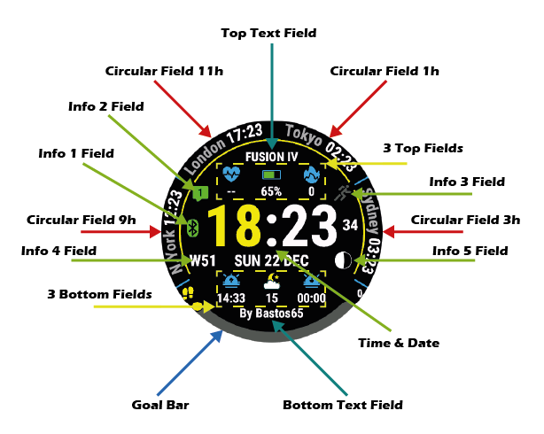
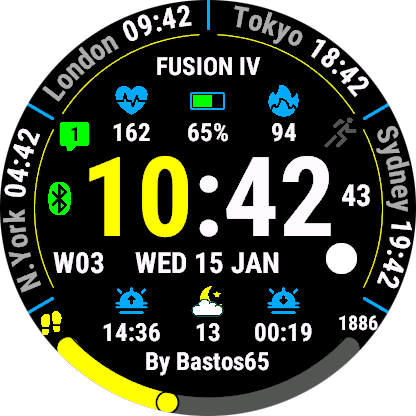
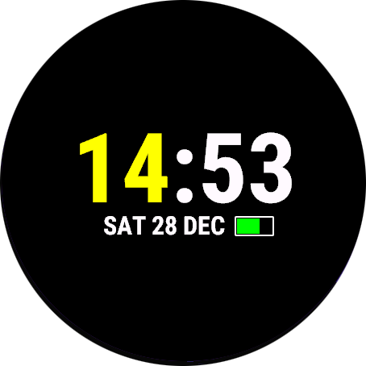
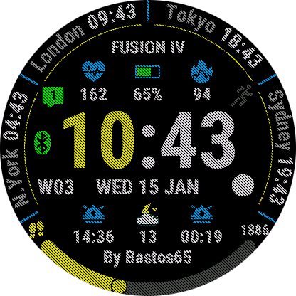

# FUSION IV - Complete Documentation

> ⚠️ **DISCLAIMER**: This repository contains user documentation only. No source code, algorithms, backend logic or licensing mechanisms are included. Any attempt to reverse engineer the product is prohibited.

---

## Table of Contents

1. [Overview](#overview)
2. [Main Features](#main-features)
3. [User Interface](#user-interface)
4. [Configuration](#configuration)
   - [System Settings](#system-settings)
   - [Display Settings](#display-settings)
   - [Data Fields](#data-fields)
   - [Color Customization](#color-customization)
   - [Weather](#weather)
5. [Available Data Types](#available-data-types)
6. [Glossary](#glossary)
7. [Appendices](#appendices)

---

---

## Overview

**FUSION IV** is a highly customizable watch face for Garmin Connect IQ watches. Designed to provide an optimal user experience, it combines modern design and functional richness with extensive customization of all on-screen elements.

### Key Features

- ✨ **Highly Customizable Interface**: 28 independently configurable colors
- 📊 **Multiple Data Fields**: 18 configurable data zones
- 🌦️ **Weather Integration**: Supports Garmin Weather and OpenWeatherMap
- ⚡ **Battery Optimization**: Intelligent power saving modes
- 🌍 **Multilingual Support**: 19 languages available
- 🎯 **Goals and Tracking**: Progress bars for your objectives
- 🌙 **Night Mode**: Configurable screen protection

---

## Main Features

### 1. Time Display

- 12h or 24h format
- Seconds display (3 modes)
- Optional leading zero for hours
- AM/PM support in 12h format
- Independent colors configuration (hours, minutes, seconds, separators)

### 2. Circular Data Fields

Four circular data fields positioned at 9h, 11h, 1h and 3h around the watch face:

- Value display
- Customizable title
- Unit display
- Multiple display modes
- Independent colors

### 3. Classic Data Fields

Six peripheral data fields:

- 3 top fields (left, center, right)
- 3 bottom fields (left, center, right)
- Colored icons
- Text values

### 4. Text Fields

- Top text field
- Bottom text field
- Full content customization
- Various display modes

### 5. Information Indicators

Five visual indicators:

1. **Bluetooth**: Phone connection status
2. **Info 2**: Top left
3. **Info 3**: Top right
4. **Info 4**: Left side of date
5. **Info 5**: Right side of date

### 6. Goal Bar

- Graphical progress visualization
- Multiple goal types
- Configurable text and icon
- Customizable colors (empty/filled/text)

### 7. Date

- 7 display formats
- Day of the week
- International format support
- Customizable color

### 8. Weather

- **Sources**: Garmin Weather and/or OpenWeatherMap
- **Available Data**:
  - Current, feels like, min/max temperature
  - Weather description and icon
  - Humidity
  - Wind speed and direction
  - Atmospheric pressure (OWM)
  - Cloud coverage (OWM)
  - Visibility (OWM)
  - Precipitation probability (GW)

---

## User Interface

### Screen Structure

*FUSION IV display layout showing all configurable zones*

### Display Modes

#### Full Display Mode

#### Always Active Mode

#### Screen Saver Mode

#### AOD (Always On Display)

### Legend
- **Time**: Time display
- **Date**: Date display
- **Circ**: Circular fields
- **TL/TC/TR**: Top fields (Left/Center/Right)
- **BL/BC/BR**: Bottom fields (Left/Center/Right)
- **I2/I3/I4/I5**: Information indicators
- **Goal Bar**: Goal progress bar

---

## Configuration

### System Settings

#### Data Refresh Rate
Controls data update frequency:

- **Full Refresh**: Complete update every second (maximum consumption)
- **High Refresh Rate**: High refresh
- **Medium Refresh Rate**: Medium refresh (recommended)
- **Low Refresh Rate**: Low refresh (battery saving)

#### Power Saving

**Screen Saver Delay**: Delay in minutes before screen saver activation (-1 to disable)

**Screen Off Delay**: Delay in minutes before screen turns off (-1 to disable)

#### Widget

**Launch Widget On Press Hold**: Launch widget on long press (touchscreen only)

---

### Display Settings

#### Time Format

**Use Military Format**: 
- `true`: 24-hour format
- `false`: 12-hour format (AM/PM)

**Hours Leading 0**: 
- `true`: Display leading zero (01, 02, 03...)
- `false`: No leading zero (1, 2, 3...)

**Seconds Display Mode**:
1. **Hidden**: Seconds hidden
2. **Normal**: Normal seconds display
3. **Always On**: Always displayed (non-AMOLED only)

#### Date Format

7 available display modes:

1. `[DOW dd Month]`: Mon 15 January
2. `[DOW dd/mm]`: Mon 15/01
3. `[dd/mm/yyyy]`: 15/01/2026
4. `[DOW Month dd]`: Mon January 15
5. `[Month dd DOW]`: January 15 Mon
6. `[DOW mm/dd]`: Mon 01/15
7. `[yyyy/mm/dd]`: 2026/01/15

---

### Data Fields

#### Configuration for Each Field

For each data field, you can configure:

1. **Data Type**: Choose from 73+ types (see Data Types section)
2. **Custom Title**: Free text to replace default title
3. **Display Mode**: How to display the data

#### Display Modes

##### Circular Fields (9h, 11h, 1h, 3h)

0. **Value**: Value only
1. **Title + Value**: Title above value
2. **Value + Unit**: Value with unit
3. **Value + Title**: Value with title below
4. **Title Value Unit**: Title, value, unit

##### Text Fields (Top/Bottom)

0. **Value**: Value only
1. **Title + Value**: Title and value
2. **Value + Unit**: Value with unit
3. **Value + Title**: Value with title
4. **Title Value Unit**: Title, value, unit
5. **Title**: Title only
6. **Goal**: Goal display
7. **Value / Goal**: Value over goal
8. **Percents Of Goal**: Goal percentage
9. **Remaining**: Remaining to reach goal

##### Goal Bar

- **Display Goal Bar Icon**: Show icon
- **Display Goal Bar Text**: Show text
- **Goal Bar Text Display Mode**: Text display mode (same options as text fields)
- **Goal Range**: Custom range (min/max) - empty to use system goal

---

### Color Customization

FUSION IV offers **28 customizable colors**:

#### Base Colors

| ID | Element | Description |
|----|---------|-------------|
| 0 | Background Color | Watch face background color |
| 1 | Circular Arcs Color | Circular arcs color |
| 2 | Circular Fields Sep Color | Circular field separators color |

#### Circular Fields Colors

| ID | Element |
|----|---------|
| 3 | Circular Fields Value Color |
| 4 | Circular Fields Title/Unit Color |

#### Time Colors

| ID | Element |
|----|---------|
| 5 | Time Hours Color |
| 6 | Time Sep Color (separator) |
| 7 | Time Minutes Color |
| 8 | Time Seconds & AM/PM Color |

#### Date Colors

| ID | Element |
|----|---------|
| 9 | Date Color |

#### Text Colors

| ID | Element |
|----|---------|
| 10 | Top Text Color |
| 11 | Bottom Text Color |

#### Indicator Colors

| ID | Element |
|----|---------|
| 12 | Info Off Color |
| 13 | Info 1 On Color (Bluetooth) |
| 14 | Info 2 On Color (Top Left) |
| 15 | Info 3 On Color (Top Right) |
| 16 | Info 4 Color (Date Side Left) |
| 17 | Info 5 Color (Date Side Right) |

#### Classic Fields Colors

| ID | Element |
|----|---------|
| 18 | Classic Fields X6 Text Color |
| 19 | Top Left Field Icon Color |
| 20 | Top Center Field Icon Color |
| 21 | Top Right Field Icon Color |
| 22 | Bottom Left Field Icon Color |
| 23 | Bottom Center Field Icon Color |
| 24 | Bottom Right Field Icon Color |

#### Goal Bar Colors

| ID | Element |
|----|---------|
| 25 | Goal Bar Off Color |
| 26 | Goal Bar On Color |
| 27 | Goal Bar Text Color |

### Predefined Color Palette

The watch face offers **67 predefined colors** organized by family.

➡️ **[View complete color list](https://pay.b65dev.com/portfolio/faqs#faq-colors)**

### Special Color Options

**Use Battery Adaptative Color**: Automatically adapts color based on battery level

**Use Weather Colored Icons**: Colors weather icons according to conditions

**Custom Colors**: Define up to 3 custom colors via hexadecimal code (format: `0xffffff` or `ffffff`)

---

### Weather

#### Provider Configuration

**Weather Provider**: Weather service selection

1. **Garmin Weather (GW)**: Native Garmin service
2. **OpenWeatherMap (OWM)**: External service requiring API key
3. **Garmin Weather + OpenWeatherMap**: Garmin priority, OWM complement
4. **OpenWeatherMap + Garmin Weather**: OWM priority, Garmin complement

#### OpenWeatherMap

**Weather Key**: OpenWeatherMap API key (32 characters max)

To obtain an API key:
1. Create an account on [openweathermap.org](https://openweathermap.org)
2. Generate a free API key
3. Copy the key into the settings

**Weather Call**: Displays last API call time (read-only)

---

### Units of Measurement

#### Altitude
- Meters (m)
- Feet (ft)

#### Distance
- Kilometers (km)
- Miles (mi)
- International Nautical Miles (nm)

#### Temperature
- Celsius (°C)
- Fahrenheit (°F)
- Kelvin (°K)

**Temperature Offset**: Temperature sensor correction (numeric value)

#### Pressure
- Hectopascal (hPa)
- Millimeters Of Mercury 0°C (mmHg)
- Inch Of Mercury 0°C (inHg)

#### Weight
- Kilograms (kg)
- Pounds (lbs)

#### Wind Speed
- Meters / Seconds (m/s)
- Kilometers / Hours (km/h)
- Miles / Hours (mi/h)
- Knots (kn)
- Beaufort Scale (bf)

#### Wind Direction
- **Degrees Direction**: Degree display (000-360)
- **Cardinal Direction**: Cardinal display (N, NE, E, SE, S, SW, W, NW)

---

### Advanced Settings

#### Custom Texts

**Custom Text 1 Value**: Free text for custom display  
**Custom Text 2 Value**: Second free text

#### Countdown

**Countdown Target Day**: Countdown target date  
**Countdown Target Hour**: Target time (format HH:mm:ss, e.g.: 14:30:00)

#### Time Zones

Configuration of 4 additional time zones:

- **Time Zone 2**: UTC format (e.g.: +02:00 or -05:30)
- **Time Zone 3**: UTC format
- **Time Zone 4**: UTC format
- **Time Zone 5**: UTC format

Format: HH:mm with + or - sign (e.g.: `+02:00`, `-05:30`)

#### Icon Sets

**Icons Set**:
- **Filled Icons**: Solid icons
- **Outlined Icons**: Outlined icons

#### Font Ratios

Adjust font sizes independently (75% to 150%):

- **Date Font Ratio**: Date size (75-130%)
- **Text Font Ratio**: Text size (75-130%)
- **Circular Fields Font Ratio**: Circular fields size (75-130%)
- **Classic Fields Font Ratio**: Classic fields size (75-130%)
- **Goal Bar Font Ratio**: Goal bar text size (75-150%)

---

## Available Data Types

FUSION IV supports **73+ different data types**. Here is the complete list:

### Physical Activity

| Type | Description |
|------|-------------|
| Active Minutes : Daily | Daily active minutes |
| Active Minutes : Weekly | Weekly active minutes |
| Calories : Daily Burned | Daily burned calories |
| Calories : Daily Burned Active | Active burned calories |
| Steps Daily | Daily step count |
| Distance : Daily | Today's distance |
| Distance : Weekly | This week's distance |
| Floors Climbed : Daily | Today's climbed floors |

### Specific Distances

| Type | Description |
|------|-------------|
| Bike Distance : Week | Week's cycling distance |
| Bike Distance : 30 Days | 30-day cycling distance |
| Bike Distance : Current Month | Current month's cycling distance |
| Run Distance : Week | Week's running distance |
| Run Distance : 30 Days | 30-day running distance |
| Run Distance : Current Month | Current month's running distance |
| Pushes | Number of pushes (if available) |
| Pushes Distance Daily | Daily push distance |

### Health and Wellness

| Type | Description |
|------|-------------|
| Heart Rate | Current heart rate |
| Heart Rate Min/Max (4 Hours) | HR min/max over 4 hours |
| Body Battery | Body battery level |
| Stress Level | Stress level |
| Respiration Rate | Respiration rate |
| Oxygen Saturation | Oxygen saturation (SpO2) |
| Recovery Time | Recovery time (hh:mm) |
| Weight | Weight in kg |

### Sports Performance

| Type | Description |
|------|-------------|
| VO2 Max Cycling | Cycling VO2 Max |
| VO2 Max Running | Running VO2 Max |
| Race Predictor 5K | 5K time prediction |
| Race Predictor 10K | 10K time prediction |
| Race Predictor Half Marathon | Half marathon prediction |
| Race Predictor Marathon | Marathon prediction |
| Training Status | Training status |

### System and Battery

| Type | Description |
|------|-------------|
| Battery In Days | Battery life in days |
| Battery In Percents | Battery level in % |
| Solar Intensity | Solar intensity |
| Phone Connected | Phone connected |
| Alarms Count | Number of alarms |
| Notifications Count | Number of notifications |
| Move Alert Level | Move alert level |
| Do Not Disturb Enabled | Do not disturb enabled |

### Environment

| Type | Description |
|------|-------------|
| Altitude | Current altitude |
| Pressure From Sensor | Atmospheric pressure |
| Temperature From Sensor | Sensor temperature |

### Weather (Garmin Weather)

| Type | Description |
|------|-------------|
| Weather Description | Weather description |
| Weather Temperature | Weather temperature |
| Weather Temperature : Feel | Feels like temperature |
| Weather Temperature : Min / Max | Min/max temperatures (GW only) |
| Weather Humidity | Humidity |
| Weather Precipitation Probability | Precipitation probability (GW) |
| Weather Wind Speed/Direction | Wind speed and direction |
| Weather GW Update Time | Garmin Weather update time |

### Weather (OpenWeatherMap)

| Type | Description |
|------|-------------|
| Weather Station | Weather station (OWM) |
| Weather Clouds Cover | Cloud coverage (OWM) |
| Weather Pressure | Pressure (OWM) |
| Weather Visibility | Visibility (OWM) |
| Weather OWM Update Time | OpenWeatherMap update time |

### Sun and Moon

| Type | Description |
|------|-------------|
| Sun Event : Daily Sunrise | Sunrise |
| Sun Event : Daily Sunset | Sunset |
| Sun Event : Next Sun Event | Next sun event |
| Sun Event : Civil Dawn | Civil dawn |
| Sun Event : Civil Dusk | Civil dusk |
| Moon Age | Moon age |
| Moon Illumination | Moon illumination |
| Moon Phase | Moon phase |

### Date and Time

| Type | Description |
|------|-------------|
| Date | Current date |
| Day Of The Year | Day of the year |
| Week Of The Year | Week of the year |
| Time Zone 2 | Time zone 2 |
| Time Zone 3 | Time zone 3 |
| Time Zone 4 | Time zone 4 |
| Time Zone 5 | Time zone 5 |
| Countdown | Countdown |

### Customization

| Type | Description |
|------|-------------|
| Custom Text | Custom text 1 |
| Custom Text 2 | Custom text 2 |
| Hidden Field | Hidden field |

### Debug

| Type | Description |
|------|-------------|
| Debug Data | Debug data |

---

## Glossary

- **AMOLED**: Active Matrix Organic Light-Emitting Diode display type
- **API**: Application Programming Interface
- **Connect IQ**: Garmin platform for third-party applications
- **GW**: Garmin Weather (Garmin weather service)
- **OWM**: OpenWeatherMap (external weather service)
- **SpO2**: Pulse oxygen saturation
- **VO2 Max**: Maximum oxygen consumption
- **UTC**: Coordinated Universal Time

---

## Appendices

### Parameter Formats

#### Custom Colors
Hexadecimal format: `0xRRGGBB` or `RRGGBB`
- RR = Red (00-FF)
- GG = Green (00-FF)
- BB = Blue (00-FF)

Example: `0xFF0000` = Pure red

#### Time Zones
Format: `±HH:mm`
- + sign for East, - for West
- HH = Hours (00-14)
- mm = Minutes (00 or 30)

Examples:
- `+01:00` = UTC+1 (Paris)
- `-05:00` = UTC-5 (New York)
- `+05:30` = UTC+5:30 (India)

#### Countdown Hour
Format: `HH:mm:ss`
- HH = Hours (00-23)
- mm = Minutes (00-59)
- ss = Seconds (00-59)

Example: `14:30:00` = 2:30 PM

### Moon Phase Codes

Moon phases are numbered from 0 to 7:
- 0: New Moon
- 1: Waxing Crescent
- 2: First Quarter
- 3: Waxing Gibbous
- 4: Full Moon
- 5: Waning Gibbous
- 6: Last Quarter
- 7: Waning Crescent

---

**Last updated**: January 2, 2026  
**Document version**: 1.0  
**Author**: Bastos65

---

*This document is provided "as is" without warranty of any kind. The developer reserves the right to modify features and documentation without notice.*
