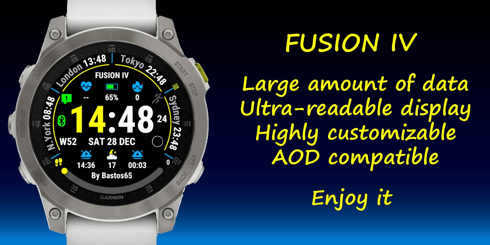
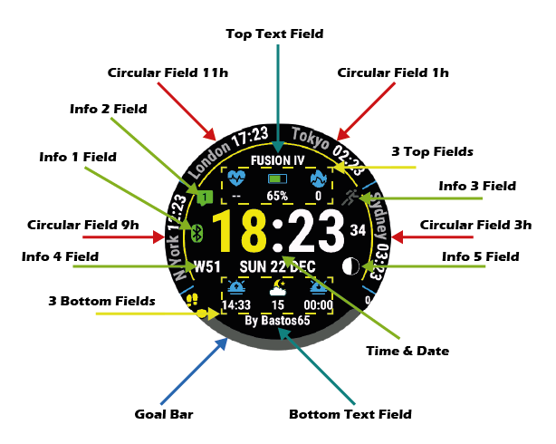
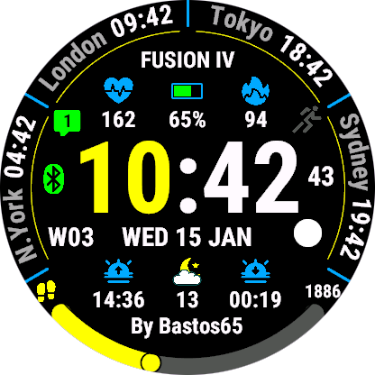
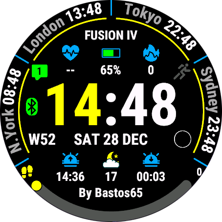
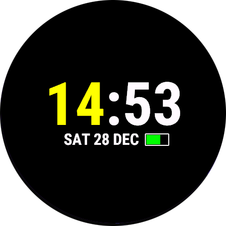
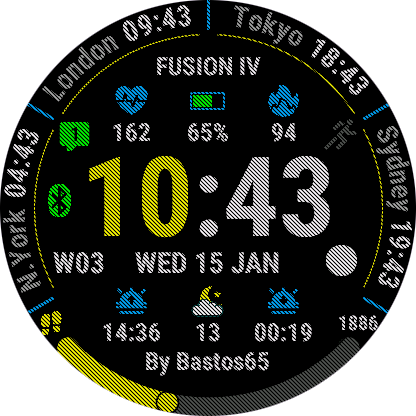

# FUSION IV - Documentation Complète

> ⚠️ **AVERTISSEMENT** : Ce dépôt contient uniquement la documentation utilisateur. Aucun code source, algorithme, logique backend ou mécanisme de licence n'est inclus. Toute tentative de rétro-ingénierie du produit est interdite.

---

## Table des Matières

1. [Présentation](#présentation)
2. [Fonctionnalités Principales](#fonctionnalités-principales)
3. [Interface Utilisateur](#interface-utilisateur)
4. [Configuration](#configuration)
   - [Paramètres Système](#paramètres-système)
   - [Paramètres d'Affichage](#paramètres-daffichage)
   - [Champs de Données](#champs-de-données)
   - [Personnalisation des Couleurs](#personnalisation-des-couleurs)
   - [Météo](#météo)
5. [Types de Données Disponibles](#types-de-données-disponibles)
6. [Glossaire](#glossaire)
7. [Annexes](#annexes)

---

---

## Présentation

**FUSION IV** est un cadran de montre hautement personnalisable pour montres Garmin Connect IQ. Conçu pour offrir une expérience utilisateur optimale, il combine design moderne et richesse fonctionnelle avec une personnalisation poussée de tous les éléments à l'écran.

### Caractéristiques Principales

- ✨ **Interface Hautement Personnalisable** : 28 couleurs configurables indépendamment
- 📊 **Multiples Champs de Données** : 18 zones de données configurables
- 🌦️ **Intégration Météo** : Support Garmin Weather et OpenWeatherMap
- ⚡ **Optimisation Batterie** : Modes d'économie d'énergie intelligents
- 🌍 **Support Multilingue** : 19 langues disponibles (date)
- 🎯 **Objectifs et Suivi** : Barres de progression pour vos objectifs
- 🌙 **Mode Nuit** : Protection d'écran configurable

---

## Fonctionnalités Principales

### 1. Affichage du Temps

- Format 12h ou 24h
- Affichage des secondes (3 modes)
- Zéro devant les heures optionnel
- Support AM/PM en format 12h
- Configuration des couleurs indépendantes (heures, minutes, secondes, séparateurs)

### 2. Champs de Données Circulaires

Quatre champs de données circulaires positionnés à 9h, 11h, 1h et 3h autour du cadran :

- Affichage de la valeur
- Titre personnalisable
- Unité affichable
- Modes d'affichage multiples
- Couleurs indépendantes

### 3. Champs de Données Classiques

Six champs de données en position périphérique :

- 3 champs supérieurs (gauche, centre, droite)
- 3 champs inférieurs (gauche, centre, droite)
- Icônes colorées
- Valeurs textuelles

### 4. Champs de Texte

- Champ texte supérieur
- Champ texte inférieur
- Personnalisation complète du contenu
- Modes d'affichage variés

### 5. Indicateurs d'Information

Cinq indicateurs visuels :

1. **Bluetooth** : État de connexion téléphone
2. **Info 2** : En haut à gauche
3. **Info 3** : En haut à droite
4. **Info 4** : Côté gauche de la date
5. **Info 5** : Côté droit de la date

### 6. Barre d'Objectif

- Visualisation graphique de la progression
- Types d'objectifs multiples
- Texte et icône configurables
- Couleurs personnalisables (vide/rempli/texte)

### 7. Date

- 7 formats d'affichage
- Jour de la semaine
- Support des formats internationaux
- Couleur personnalisable

### 8. Météo

- **Sources** : Garmin Weather et/ou OpenWeatherMap
- **Données disponibles** :
  - Température actuelle, ressentie, min/max
  - Description et icône météo
  - Humidité
  - Vitesse et direction du vent
  - Pression atmosphérique (OWM)
  - Couverture nuageuse (OWM)
  - Visibilité (OWM)
  - Probabilité de précipitations (GW)

---

## Interface Utilisateur

### Structure de l'Écran

*Disposition de FUSION IV montrant toutes les zones configurables*

### Modes d'Affichage

#### Mode Affichage Complet

#### Mode Toujours Actif

#### Mode Économiseur d'Écran

#### AOD (Always On Display)

### Légende
- **Time** : Affichage de l'heure
- **Date** : Affichage de la date
- **Circ** : Champs circulaires
- **TL/TC/TR** : Champs haut (Left/Center/Right)
- **BL/BC/BR** : Champs bas (Left/Center/Right)
- **I2/I3/I4/I5** : Indicateurs d'information
- **Goal Bar** : Barre de progression d'objectif

---

## Configuration

### Paramètres Système

#### Taux de Rafraîchissement des Données
Contrôle la fréquence de mise à jour des données :

- **Full Refresh** : Mise à jour complète à chaque seconde (consommation maximale)
- **High Refresh Rate** : Rafraîchissement élevé
- **Medium Refresh Rate** : Rafraîchissement moyen (recommandé)
- **Low Refresh Rate** : Rafraîchissement faible (économie batterie)

#### Économie d'Énergie

**Screen Saver Delay** : Délai en minutes avant l'activation de l'économiseur d'écran (-1 pour désactiver)

**Screen Off Delay** : Délai en minutes avant l'extinction de l'écran (-1 pour désactiver)

#### Widget

**Launch Widget On Press Hold** : Lance un widget au maintien de la pression (écrans tactiles uniquement)

---

### Paramètres d'Affichage

#### Format de l'Heure

**Use Military Format** : 
- `true` : Format 24 heures
- `false` : Format 12 heures (AM/PM)

**Hours Leading 0** : 
- `true` : Affiche le zéro devant (01, 02, 03...)
- `false` : Pas de zéro (1, 2, 3...)

**Seconds Display Mode** :
1. **Hidden** : Secondes masquées
2. **Normal** : Affichage normal des secondes
3. **Always On** : Toujours affichées (hors AMOLED)

#### Format de la Date

7 modes d'affichage disponibles :

1. `[DOW dd Month]` : Lun 15 Janvier
2. `[DOW dd/mm]` : Lun 15/01
3. `[dd/mm/yyyy]` : 15/01/2026
4. `[DOW Month dd]` : Lun Janvier 15
5. `[Month dd DOW]` : Janvier 15 Lun
6. `[DOW mm/dd]` : Lun 01/15
7. `[yyyy/mm/dd]` : 2026/01/15

---

### Champs de Données

#### Configuration de Chaque Champ

Pour chaque champ de données, vous pouvez configurer :

1. **Type de Données** : Choix parmi 73+ types (voir section Types de Données)
2. **Titre Personnalisé** : Texte libre pour remplacer le titre par défaut
3. **Mode d'Affichage** : Comment afficher la donnée

#### Modes d'Affichage

##### Champs Circulaires (9h, 11h, 1h, 3h)

0. **Value** : Valeur uniquement
1. **Title + Value** : Titre au-dessus de la valeur
2. **Value + Unit** : Valeur avec unité
3. **Value + Title** : Valeur avec titre en dessous
4. **Title + Value + Unit** : Titre, valeur, unité

##### Champs Texte (Haut/Bas)

0. **Value** : Valeur uniquement
1. **Title + Value** : Titre et valeur
2. **Value + Unit** : Valeur avec unité
3. **Value + Title** : Valeur avec titre
4. **Title + Value + Unit** : Titre, valeur, unité

##### Barre d'Objectif

- **Display Goal Bar Icon** : Afficher l'icône
- **Display Goal Bar Text** : Afficher le texte
- **Goal Bar Text Display Mode** : Mode d'affichage du texte :
  - 0. **Value** : Valeur uniquement
  - 5. **Title** : Titre uniquement
  - 6. **Goal** : Affichage de l'objectif
  - 7. **Value / Goal** : Valeur sur objectif
  - 8. **Percents Of Goal** : Pourcentage de l'objectif
  - 9. **Remaining** : Restant pour atteindre l'objectif
- **Goal Range** : Plage personnalisée (min/max) - vide pour utiliser l'objectif système

---

### Personnalisation des Couleurs

FUSION IV offre **28 couleurs personnalisables** :

#### Couleurs de Base

| ID | Élément | Description |
|----|------------|-------------|
| 0 | Background Color | Couleur de fond du cadran |
| 1 | Circular Arcs Color | Couleur des arcs circulaires |
| 2 | Circular Fields Sep Color | Couleur des séparateurs des champs circulaires |

#### Couleurs des Champs Circulaires

| ID | Élément |
|----|---------|
| 3 | Circular Fields Value Color |
| 4 | Circular Fields Title/Unit Color |

#### Couleurs de l'Heure

| ID | Élément |
|----|---------|
| 5 | Time Hours Color |
| 6 | Time Sep Color (séparateur) |
| 7 | Time Minutes Color |
| 8 | Time Seconds & AM/PM Color |

#### Couleurs de la Date

| ID | Élément |
|----|---------|
| 9 | Date Color |

#### Couleurs des Textes

| ID | Élément |
|----|---------|
| 10 | Top Text Color |
| 11 | Bottom Text Color |

#### Couleurs des Indicateurs

| ID | Élément |
|----|---------|
| 12 | Info Off Color |
| 13 | Info 1 On Color (Bluetooth) |
| 14 | Info 2 On Color (Top Left) |
| 15 | Info 3 On Color (Top Right) |
| 16 | Info 4 Color (Date Side Left) |
| 17 | Info 5 Color (Date Side Right) |

#### Couleurs des Champs Classiques

| ID | Élément |
|----|---------|
| 18 | Classic Fields X6 Text Color |
| 19 | Top Left Field Icon Color |
| 20 | Top Center Field Icon Color |
| 21 | Top Right Field Icon Color |
| 22 | Bottom Left Field Icon Color |
| 23 | Bottom Center Field Icon Color |
| 24 | Bottom Right Field Icon Color |

#### Couleurs de la Barre d'Objectif

| ID | Élément |
|----|---------|
| 25 | Goal Bar Off Color |
| 26 | Goal Bar On Color |
| 27 | Goal Bar Text Color |

### Palette de Couleurs Prédéfinies

Le cadran propose **67 couleurs prédéfinies** organisées par famille.

➡️ **[Voir la liste complète des couleurs](https://pay.b65dev.com/portfolio/faqs#faq-colors)**

### Options Spéciales de Couleurs

**Use Battery Adaptative Color** : Adapte automatiquement la couleur en fonction du niveau de batterie

**Use Weather Colored Icons** : Colore les icônes météo selon les conditions

**Custom Colors** : Définir jusqu'à 3 couleurs personnalisées via code hexadécimal (format : `0xffffff` ou `ffffff`)

---

### Météo

#### Configuration du Fournisseur

**Weather Provider** : Choix du service météo

1. **Garmin Weather (GW)** : Service Garmin natif
2. **OpenWeatherMap (OWM)** : Service externe nécessitant une clé API
3. **Garmin Weather + OpenWeatherMap** : Priorité Garmin, complément OWM
4. **OpenWeatherMap + Garmin Weather** : Priorité OWM, complément Garmin

#### OpenWeatherMap

**Weather Key** : Clé API OpenWeatherMap (32 caractères max)

Pour obtenir une clé API :
1. Créer un compte sur [openweathermap.org](https://openweathermap.org)
2. Générer une clé API gratuite
3. Copier la clé dans les paramètres

**Weather Call** : Affiche l'heure du dernier appel API (lecture seule)

---

### Unités de Mesure

#### Altitude
- Meters (m)
- Feet (ft)

#### Distance
- Kilometers (km)
- Miles (mi)
- International Nautical Miles (nm)

#### Température
- Celsius (°C)
- Fahrenheit (°F)
- Kelvin (°K)

**Temperature Offset** : Correction du capteur de température (valeur numérique)

#### Pression
- Hectopascal (hPa)
- Millimeters Of Mercury 0°C (mmHg)
- Inch Of Mercury 0°C (inHg)

#### Poids
- Kilogrammes (kg)
- Pounds (lbs)

#### Vitesse du Vent
- Meters / Seconds (m/s)
- Kilometers / Hours (km/h)
- Miles / Hours (mi/h)
- Knots (kn)
- Beaufort Scale (bf)

#### Direction du Vent
- **Degrees Direction** : Affichage en degrés (000-360)
- **Cardinal Direction** : Affichage cardinal (N, NE, E, SE, S, SW, W, NW)

---

### Paramètres Avancés

#### Textes Personnalisés

**Custom Text 1 Value** : Texte libre pour affichage personnalisé  
**Custom Text 2 Value** : Deuxième texte libre

#### Compte à Rebours

**Countdown Target Day** : Date cible du compte à rebours  
**Countdown Target Hour** : Heure cible (format HH:mm:ss, ex: 14:30:00)

#### Fuseaux Horaires

Configuration de 4 fuseaux horaires additionnels :

- **Time Zone 2** : Format UTC (ex: +02:00 ou -05:30)
- **Time Zone 3** : Format UTC
- **Time Zone 4** : Format UTC
- **Time Zone 5** : Format UTC

Format : HH:mm avec signe + ou - (ex: `+02:00`, `-05:30`)

#### Jeux d'Icônes

**Icons Set** :
- **Filled Icons** : Icônes pleines
- **Outlined Icons** : Icônes en contour

#### Ratios de Police

Ajuster la taille des polices indépendamment (75% à 150%) :

- **Date Font Ratio** : Taille de la date (75-130%)
- **Text Font Ratio** : Taille des textes (75-130%)
- **Circular Fields Font Ratio** : Taille des champs circulaires (75-130%)
- **Classic Fields Font Ratio** : Taille des champs classiques (75-130%)
- **Goal Bar Font Ratio** : Taille du texte de la barre d'objectif (75-150%)

---

## Types de Données Disponibles

FUSION IV supporte **73+ types de données** différents. Voici la liste complète :

### Activité Physique

| Type | Description |
|------|-------------|
| Active Minutes : Daily | Minutes actives du jour |
| Active Minutes : Weekly | Minutes actives de la semaine |
| Calories : Daily Burned | Calories brûlées dans la journée |
| Calories : Daily Burned Active | Calories actives brûlées |
| Steps Daily | Nombre de pas du jour |
| Distance : Daily | Distance parcourue aujourd'hui |
| Distance : Weekly | Distance parcourue cette semaine |
| Floors Climbed : Daily | Étages montés aujourd'hui |

### Distances Spécifiques

| Type | Description |
|------|-------------|
| Bike Distance : Week | Distance vélo de la semaine |
| Bike Distance : 30 Days | Distance vélo sur 30 jours |
| Bike Distance : Current Month | Distance vélo du mois en cours |
| Run Distance : Week | Distance course de la semaine |
| Run Distance : 30 Days | Distance course sur 30 jours |
| Run Distance : Current Month | Distance course du mois |
| Pushes | Nombre de poussées (si disponible) |
| Pushes Distance Daily | Distance de poussée quotidienne |

### Santé et Bien-être

| Type | Description |
|------|-------------|
| Heart Rate | Fréquence cardiaque actuelle |
| Heart Rate Min/Max (4 Hours) | FC min/max sur 4 heures |
| Body Battery | Niveau de batterie corporelle |
| Stress Level | Niveau de stress |
| Respiration Rate | Fréquence respiratoire |
| Oxygen Saturation | Saturation en oxygène (SpO2) |
| Recovery Time | Temps de récupération (hh:mm) |
| Weight | Poids en kg |

### Performance Sportive

| Type | Description |
|------|-------------|
| VO2 Max Cycling | VO2 Max cyclisme |
| VO2 Max Running | VO2 Max course |
| Race Predictor 5K | Prédiction temps 5km |
| Race Predictor 10K | Prédiction temps 10km |
| Race Predictor Half Marathon | Prédiction semi-marathon |
| Race Predictor Marathon | Prédiction marathon |
| Training Status | Statut d'entraînement |

### Système et Batterie

| Type | Description |
|------|-------------|
| Battery In Days | Autonomie batterie en jours |
| Battery In Percents | Niveau batterie en % |
| Solar Intensity | Intensité solaire |
| Phone Connected | Téléphone connecté |
| Alarms Count | Nombre d'alarmes |
| Notifications Count | Nombre de notifications |
| Move Alert Level | Niveau d'alerte de mouvement |
| Do Not Disturb Enabled | Ne pas déranger activé |

### Environnement

| Type | Description |
|------|-------------|
| Altitude | Altitude actuelle |
| Pressure From Sensor | Pression atmosphérique |
| Temperature From Sensor | Température du capteur |

### Météo (Garmin Weather)

| Type | Description |
|------|-------------|
| Weather Description | Description météo |
| Weather Temperature | Température météo |
| Weather Temperature : Feel | Température ressentie |
| Weather Temperature : Min / Max | Températures min/max (GW uniquement) |
| Weather Humidity | Humidité |
| Weather Precipitation Probability | Probabilité précipitations (GW) |
| Weather Wind Speed/Direction | Vitesse et direction du vent |
| Weather GW Update Time | Heure MAJ Garmin Weather |

### Météo (OpenWeatherMap)

| Type | Description |
|------|-------------|
| Weather Station | Station météo (OWM) |
| Weather Clouds Cover | Couverture nuageuse (OWM) |
| Weather Pressure | Pression (OWM) |
| Weather Visibility | Visibilité (OWM) |
| Weather OWM Update Time | Heure MAJ OpenWeatherMap |

### Soleil et Lune

| Type | Description |
|------|-------------|
| Sun Event : Daily Sunrise | Lever du soleil |
| Sun Event : Daily Sunset | Coucher du soleil |
| Sun Event : Next Sun Event | Prochain événement solaire |
| Sun Event : Civil Dawn | Aube civile |
| Sun Event : Civil Dusk | Crépuscule civil |
| Moon Age | Âge de la lune |
| Moon Illumination | Illumination lunaire |
| Moon Phase | Phase lunaire |

### Date et Heure

| Type | Description |
|------|-------------|
| Date | Date actuelle |
| Day Of The Year | Jour de l'année |
| Week Of The Year | Semaine de l'année |
| Time Zone 2 | Fuseau horaire 2 |
| Time Zone 3 | Fuseau horaire 3 |
| Time Zone 4 | Fuseau horaire 4 |
| Time Zone 5 | Fuseau horaire 5 |
| Countdown | Compte à rebours |

### Personnalisation

| Type | Description |
|------|-------------|
| Custom Text | Texte personnalisé 1 |
| Custom Text 2 | Texte personnalisé 2 |
| Hidden Field | Champ masqué |

### Debug

| Type | Description |
|------|-------------|
| Debug Data | Données de débogage |

---

## Glossaire

- **AMOLED** : Type d'écran à matrice active à diodes électroluminescentes organiques
- **API** : Application Programming Interface (Interface de programmation d'application)
- **Connect IQ** : Plateforme Garmin pour applications tierces
- **GW** : Garmin Weather (service météo Garmin)
- **OWM** : OpenWeatherMap (service météo externe)
- **SpO2** : Saturation pulsée en oxygène
- **VO2 Max** : Consommation maximale d'oxygène
- **UTC** : Temps Universel Coordonné

---

## Annexes

### Format des Paramètres

#### Custom Colors
Format hexadécimal : `0xRRGGBB` ou `RRGGBB`
- RR = Rouge (00-FF)
- GG = Vert (00-FF)
- BB = Bleu (00-FF)

Exemple : `0xFF0000` = Rouge pur

#### Time Zones
Format : `±HH:mm`
- Signe + pour Est, - pour Ouest
- HH = Heures (00-14)
- mm = Minutes (00 ou 30)

Exemples :
- `+01:00` = UTC+1 (Paris)
- `-05:00` = UTC-5 (New York)
- `+05:30` = UTC+5:30 (Inde)

#### Countdown Hour
Format : `HH:mm:ss`
- HH = Heures (00-23)
- mm = Minutes (00-59)
- ss = Secondes (00-59)

Exemple : `14:30:00` = 14h30

### Codes de Phases Lunaires

Les phases lunaires sont numérotées de 0 à 7 :
- 0 : Nouvelle Lune
- 1 : Premier Croissant
- 2 : Premier Quartier
- 3 : Gibbeuse Croissante
- 4 : Pleine Lune
- 5 : Gibbeuse Décroissante
- 6 : Dernier Quartier
- 7 : Dernier Croissant

---

**Dernière mise à jour** : 2 Janvier 2026  
**Version du document** : 1.0  
**Auteur** : Bastos65

---

*Ce document est fourni "tel quel" sans garantie d'aucune sorte. Le développeur se réserve le droit de modifier les fonctionnalités et la documentation sans préavis.*
